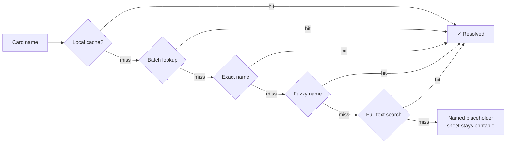

<div align="center">

# 🗿 Cardboard Golem

**Assembled, not purchased.**

Turn any Magic: The Gathering deck list into print-ready proxy sheets — at exactly 63 × 88 mm, from a single HTML file, with no install, no server, and no build step.

[](#)
[](#)
[](#)
[](LICENSE)

</div>

---

The two READMEs

They're genuinely different documents, not one hedged compromise:

	README.md	README-professional.md
Audience	Players browsing GitHub	Evaluators, contributors, enterprise
Demo	ASCII layout sketch + Mermaid flowchart + 4-step table	Numbered procedure, no illustration
Voice	"an unreasonable amount of respect for millimetres"	"Dimensional accuracy is non-negotiable"
Extras	Collapsible explainers, badges	TOC, architecture map, browser matrix, roadmap, security statement

## Why this exists

Proxy printers usually fail in the same two ways: the cards come out 4 % too small to sleeve alongside real ones, and the tool stops working the day its CDN goes down.

Cardboard Golem fixes both by refusing to trust the browser with your geometry. It writes its **own PDF**, byte by byte, with every card placed at exact millimetre coordinates. The page box is authoritative — no print dialog, no `@page` negotiation, and no "fit to page" checkbox gets a vote.

Everything else follows from that: one file, zero dependencies, system fonts only, and an image cache that survives losing your internet connection.

---

## Demo

### The page

```
┌──────────────────────────┬────────────────────────────────────┐
│  🗿 CARDBOARD GOLEM      │  Cards 36 · Sheets 4 · Grid 3×3    │
├──────────────────────────┼────────────────────────────────────┤
│                          │                                    │
│  1 · DECK LIST           │   ░░░░ cutting mat ░░░░░░░░░░░░    │
│  ┌────────────────────┐📁│   ┌──────────────────────────┐     │
│  │ 4 Lightning Bolt   │  │   │  ┌────┐ ┌────┐ ┌────┐    │     │
│  │ 2 Ragavan (MH2)138 │  │   │  │    │ │    │ │    │    │     │
│  └────────────────────┘  │   │  └────┘ └────┘ └────┘    │     │
│  [ Import list ] [Clear] │   │  ┌────┐ ┌────┐ ┌────┐    │     │
│                          │   │  │    │ │    │ │    │    │     │
│  2 · CARDS               │   │  └────┘ └────┘ └────┘    │     │
│  🔍 Search any card…     │   │  ┌────┐ ┌────┐ ┌────┐    │     │
│  ┌──┐ Lightning Bolt     │   │  │    │ │    │ │    │    │     │
│  │▨▨│ €1.20 ↑3% · MH2    │   │  └────┘ └────┘ └────┘    │     │
│  └──┘  [−] 4 [+] ⊕ Art × │   └──────────────────────────┘     │
│                          │      ✂ crop marks · 100 mm ruler   │
│  3 · SHEET SETUP         │                                    │
│  4 · OUTPUT              │                                    │
├──────────────────────────┤                                    │
│ 36 cards · 4 sheets      │                                    │
│ value ~€214              │                                    │
│ ▓▓▓▓ EXPORT PDF ▓▓▓▓     │                                    │
└──────────────────────────┴────────────────────────────────────┘
```

### The flow — four steps, about ninety seconds

| | Do this | You get |
|:--:|---|---|
| **1** | Paste a deck list, drop a `.txt`, or search cards by name | Every card resolves against Scryfall |
| **2** | Tune counts with `−/+`, swap art, add tokens with `⊕` | The preview redraws live on the mat |
| **3** | Pick paper, cut guides, image quality | Grid recalculates in real millimetres |
| **4** | **Export PDF** → print at *Actual size* | 9 exact 63 × 88 mm cards per A4 sheet |

> **The only setting that can hurt you:** printer scaling. Set it to *Actual size* / 100 %, never "Fit to page". Sheet 1 carries a 100 mm ruler — measure it once and you'll know for certain.

### How a card gets found

Nothing gives up until every option is exhausted.



---

## Features

**Print engine**
- Hand-written PDF generator — no jsPDF, no libraries, exact millimetre placement
- Source art is **never resampled**; scaling is left to your printer's RIP, which does it better
- Lossless PNG embedding for razor-sharp card text, or JPEG q95 for smaller files
- Crop marks, full cut lines, adjustable gap, safe margins, A4 & Letter in both orientations
- A 100 mm calibration ruler on sheet 1, so you can prove your printer didn't cheat

**Card resolution**
- Reads Arena, Moxfield, MTGO and plain formats — plus bullets, tab-separated Excel dumps, counts written after the name, and stray BOM bytes
- Missing quantities default to `1`, so a messy list never fails
- Five-tier fallback ladder ending in a printable placeholder, never a crash
- Live autocomplete search across every Magic card ever printed

**Beyond the basics**
- **Token detection** — one tap adds every token a card creates, fetched by exact ID
- **Price + trend** — EUR or USD, with ↑/↓ arrows the app builds from its own daily snapshots
- **Dual art sources** — Scryfall printings and MPCFill community renders, side by side
- **Low-res warnings** — flags printings where Scryfall only has a poor scan, before you waste paper
- **True offline** — card data and images cached in IndexedDB; reprint with the network unplugged
- **Mobile-first** — 44 px tap targets, 16 px inputs (no iOS auto-zoom), thumb-reachable tab bar

---

## Installation

```bash
git clone https://github.com/you/cardboard-golem.git
cd cardboard-golem
```

Then double-click `index.html`. That's the whole installation.

**Recommended:** serve it over localhost instead.

```bash
python3 -m http.server 8000
# → http://localhost:8000
```

<details>
<summary><strong>Why bother with a server for a local file?</strong></summary>

Opening `index.html` from disk gives the page a `null` origin. Some browser and network combinations reject cross-site requests from that origin, which breaks the fast batch lookup and can block image caching. The app detects this and shows a clear message with instructions — but serving over `localhost` avoids it entirely and makes bulk imports noticeably faster.

</details>

**Requirements:** any modern browser (Chrome, Edge, Firefox, Safari). No Node, no Python needed for the app itself, no package manager, no build.

---

## Configuration

Everything lives in the app UI and persists to `localStorage`. Sensible defaults mean you can ignore all of it.

| Setting | Default | Notes |
|---|---|---|
| Paper | A4 | A4 / Letter, portrait or landscape |
| Image source | PNG · 745 px | 745 px = exactly 300 dpi at card size |
| Cut guides | Crop marks | Marks in margin, full cut lines, or none |
| Card size | 63 × 88 mm | Override if your printer runs consistently off |
| Gap | 0 mm | Space between cards on the sheet |
| Safe margin | 6.5 mm | Keeps content out of the printer's dead zone |
| PDF encoding | JPEG q95 | Or lossless PNG — bigger file, sharper text |
| Prices | EUR | EUR (Cardmarket), USD (TCGplayer), or off |
| Scale bar | On | 100 mm ruler on sheet 1 |
| Both faces | On | Print the back of double-faced cards |
| Image cache | On | Store art in IndexedDB for offline use |

**Keyboard:** `Ctrl/Cmd + Enter` imports · `Ctrl/Cmd + P` exports the PDF (deliberately hijacked — the browser print path is the one that mis-scales).

---

## Known limits

Honesty beats surprises.

| Limit | Why |
|---|---|
| Max sharpness is 300 dpi | Scryfall's largest image is 745 px. Printing at 1200 dpi cannot invent detail that isn't in the file |
| Trend arrows need two days | No keyless price-history API exists, so the app accumulates its own snapshots |
| MPCFill art may not embed in PDFs | Those images live on Google Drive, which can block canvas reads. The app pre-checks and warns you |
| Re-import clears tokens and manual additions | The list rebuilds from the textarea, which doesn't contain them |

---

## Contributing

Issues and pull requests are welcome.

**Ground rules**
1. **Keep it one file.** The single-file constraint is the feature, not an accident.
2. **No runtime dependencies.** No CDNs, no webfonts, no npm. It must work with the network unplugged.
3. **Never break the millimetres.** If a change touches layout or the PDF writer, verify the 100 mm ruler still measures 100 mm on paper.
4. **Match the house style.** Comments and internal identifiers are in Finnish; all user-facing UI text is in English.

**Before opening a PR**
- Test at 375 px width and 1440 px width
- Export a PDF and open it in a real PDF reader, not just the browser preview
- Confirm the app still loads with DevTools set to offline

See [CONTRIBUTING.md](CONTRIBUTING.md) for the full guide.

---

## License

Code is [MIT licensed](LICENSE). Do what you like with it.

**The cards are not.** Card names, images, art, mana symbols and Oracle text are © Wizards of the Coast LLC.

> Cardboard Golem is unofficial Fan Content permitted under the Wizards of the Coast Fan Content Policy. Not approved or endorsed by Wizards. Portions of the materials used are property of Wizards of the Coast. © Wizards of the Coast LLC.
>
> Card data and imagery are provided by [Scryfall](https://scryfall.com). This project is not produced by, endorsed by, or affiliated with Scryfall, LLC. Scryfall data must never be paywalled or placed behind any account, survey, or subscription requirement.

**Use proxies responsibly:** for personal playtesting and kitchen-table games. They are not tournament legal, and selling them is both against the Fan Content Policy and straightforwardly illegal.

---

<div align="center">
<sub>Built with zero dependencies and an unreasonable amount of respect for millimetres.</sub>
</div>
