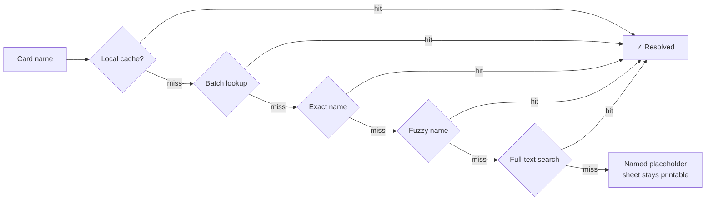

<div align="center">

# 🗿 Cardboard Golem

**Assembled, not purchased.**

Turn any Magic: The Gathering deck list — typed, pasted, dropped, or **scanned with your camera** — into print-ready proxy sheets at exactly 63 × 88 mm, from a single HTML file.

[](#one-optional-dependency)
[](#)
[](#)
[](LICENSE)

</div>

---

## Demo

<div align="center">
   
### Card Import


---

### Manual Search & Card Rules 


---

### Card Art Selection Tool 


---

</div>

### The page


## Why this exists

Proxy printers usually fail in the same two ways: the cards come out a few percent too small to sleeve alongside real ones, and the tool stops working the day its CDN changes a URL.

Cardboard Golem fixes both by refusing to trust the browser with your geometry. It writes its **own PDF**, byte by byte, with every card placed at exact millimetre coordinates. The page box is authoritative — no print dialog, no `@page` negotiation, and no "fit to page" checkbox gets a vote.

Everything else follows from that: one file, no build step, system fonts only, and a card cache that survives losing your internet connection.

---
```
┌──────────────────────────┬────────────────────────────────────┐
│  🗿 CARDBOARD GOLEM      │  Cards 36 · Sheets 4 · Grid 3×3    │
├──────────────────────────┼────────────────────────────────────┤
│                          │                                    │
│  1 · DECK LIST        📁 │   ░░░░ cutting mat ░░░░░░░░░░░░    │
│  ┌────────────────────┐  │   ┌──────────────────────────┐     │
│  │ 4 Lightning Bolt   │  │   │  ┌────┐ ┌────┐ ┌────┐    │     │
│  │ 2 Ragavan (MH2)138 │  │   │  │    │ │    │ │    │    │     │
│  └────────────────────┘  │   │  └────┘ └────┘ └────┘    │     │
│  [ Import list ] [Clear] │   │  ┌────┐ ┌────┐ ┌────┐    │     │
│                          │   │  │    │ │▓▓▓▓│ │    │    │     │
│  2 · CARDS               │   │  └────┘ └────┘ └────┘    │     │
│  🔍 Search any card…  📷 │   │  ┌────┐ ┌────┐ ┌────┐    │     │
│  ┌──┐ Lightning Bolt     │   │  │    │ │    │ │    │    │     │
│  │▨▨│ €1.20 ↑3% · MH2    │   │  └────┘ └────┘ └────┘    │     │
│  └──┘ [−] 4 [+] ⊕ ⓘ Art×│   └──────────────────────────┘     │
│                          │      ✂ crop marks · 100 mm ruler   │
│  3 · SHEET SETUP         │                                    │
│  4 · OUTPUT              │                                    │
├──────────────────────────┤                                    │
│ 36 cards · 4 sheets      │                                    │
│ value ~€214           
   │                                    │
│ ▓▓▓▓ EXPORT PDF ▓▓▓▓     │                                    │
└──────────────────────────┴────────────────────────────────────┘
```

### The flow — four steps, about ninety seconds

| | Do this | You get |
|:--:|---|---|
| **1** | Paste a list, drop a `.txt` 📁, search by name 🔍, or scan cards with the camera 📷 | Every card resolves against Scryfall |
| **2** | Tune counts `−/+`, add tokens `⊕`, check rules `ⓘ`, swap art | The preview redraws live on the mat |
| **3** | Pick paper, cut guides, image quality | Grid recalculates in real millimetres |
| **4** | **Export PDF** → print at *Actual size* | 9 exact 63 × 88 mm cards per A4 sheet |

> **The only setting that can hurt you:** printer scaling. Set it to *Actual size* / 100 %, never "Fit to page". Sheet 1 carries a 100 mm ruler — measure it once and you'll know for certain.

### How a card gets found

Nothing gives up until every option is exhausted.



If Scryfall ever answers with *"slow down"* instead of data, the app backs off, retries, and — if that fails — stops cleanly rather than hammering. Cards it never reached stay pending, so **Retry missing** picks up exactly where it left off.

---

## Features

**Print engine**
- Hand-written PDF generator — no jsPDF, no libraries, exact millimetre placement
- Source art is **never resampled**; scaling is left to your printer's RIP, which does it better
- Lossless PNG embedding for razor-sharp card text, or JPEG q95 for smaller files
- Crop marks, full cut lines, adjustable gap, safe margins, A4 & Letter in both orientations
- A 100 mm calibration ruler on sheet 1, so you can prove your printer didn't cheat

**Getting cards in**
- Reads Arena, Moxfield, MTGO and plain formats — plus bullets, tab-separated spreadsheet dumps, counts written after the name, and stray BOM bytes
- Missing quantities default to `1`, so a messy list never fails
- **Live search** across every Magic card ever printed, with keyboard navigation
- **Camera scanning** in batch mode — scan a physical deck card after card without leaving the viewfinder

**Knowing what you've got**
- **ⓘ Card rules** — Oracle text with rendered mana symbols, plain-English keyword explanations, and official rulings
- **⊕ Token detection** — one tap adds every token a card creates, fetched by exact ID
- **Prices + trends** — EUR or USD with ↑/↓ arrows the app builds from its own daily snapshots, plus total deck value
- **Low-res warnings** — flags printings where Scryfall only has a poor scan, before you waste paper

**Everything else**
- **Dual art sources** — Scryfall printings and MPCFill community renders, side by side
- **True offline** — card data and images cached in IndexedDB; reprint with the network unplugged
- **Mobile-first** — 44 px tap targets, 16 px inputs (no iOS auto-zoom), thumb-reachable tab bar
- **It's alive** — the golem breathes while idle and dissolves into a pixel wave while working

---

## Installation

```bash
git clone https://github.com/Maxilaniva/cardboard-golem.git
cd cardboard-golem
```

Then double-click `index.html`. That's the whole installation.

**Strongly recommended:** serve it over localhost instead.

```bash
python3 -m http.server 8000
# → http://localhost:8000
```

<details>
<summary><strong>Why bother with a server for a local file?</strong></summary>

Opening `index.html` from disk gives the page a `null` origin, and that costs you three things:

1. **The fast batch lookup breaks.** It needs a CORS preflight that a `null` origin loses, so a 100-card deck falls back to 100+ individual requests instead of 2. That's roughly 50× the traffic and makes rate limiting far more likely.
2. **The camera is disabled entirely.** Browsers only allow camera access on HTTPS or `localhost`. A `file://` page can never use it — and neither can a LAN address like `http://192.168.1.50:8000`.
3. **Image caching may be blocked**, which weakens offline support.

The app detects all three and explains them in place, but serving over `localhost` avoids the whole category.

</details>

**Requirements:** any modern browser (Chrome, Edge, Firefox, Safari 16+). No Node, no package manager, no build.

---

## One optional dependency

The core app has **zero runtime dependencies**. It loads no CDN, no webfont, no framework — open it with the network unplugged and everything works.

There is exactly one exception. **Camera scanning downloads a text-recognition engine ([Tesseract.js](https://github.com/naptha/tesseract.js)) from jsDelivr the first time you press Scan.** Never before, and never at page load.

Why the exception stays contained:

- Scanning already requires a camera, a secure context, and a network connection. It cannot work offline regardless.
- Nothing else in the app touches it. Deck import, PDF export, printing and the offline cache are unaffected.
- If the download fails, the scanner still shows you an enlarged crop of the card name to read and type in yourself.

If you want a genuinely dependency-free file, delete the `OCR_CDN` constant and the `kaynnistaWorker()` function in § 11. The camera keeps working as capture-and-read-manually.

---

## Configuration

Everything lives in the app UI and persists to `localStorage`. Sensible defaults mean you can ignore all of it.

| Setting | Default | Notes |
|---|---|---|
| Paper | A4 | A4 / Letter, portrait or landscape |
| Image source | PNG · 745 px | 745 px = exactly 300 dpi at card size |
| Cut guides | Crop marks | Marks in margin, full cut lines, or none |
| Card size | 63 × 88 mm | Override if your printer runs consistently off |
| Gap | 0 mm | Space between cards on the sheet |
| Safe margin | 6.5 mm | Keeps content out of the printer's dead zone |
| PDF encoding | JPEG q95 | Or lossless PNG — bigger file, sharper text |
| Prices | EUR | EUR (Cardmarket), USD (TCGplayer), or off |
| Scale bar | On | 100 mm ruler on sheet 1 |
| Both faces | On | Print the back of double-faced cards |
| Image cache | On | Store art in IndexedDB for offline use |

**Keyboard:** `Ctrl/Cmd + Enter` imports · `Ctrl/Cmd + P` exports the PDF (deliberately hijacked — the browser print path is the one that mis-scales) · `↑ ↓` navigate search results · `Esc` closes.

---

## Known limits

Honesty beats surprises.

| Limit | Why |
|---|---|
| Max sharpness is 300 dpi | Scryfall's largest image is 745 px. Printing at 1200 dpi cannot invent detail that isn't in the file |
| Camera needs HTTPS or localhost | Browser security rule; `file://` and LAN IP addresses are both blocked from camera access |
| Scanning lands roughly 70–85 % first try | Stylised fonts and phone lighting; foils are the hard case. Misreads fall through to a pick-one-of-three prompt |
| Trend arrows need two days | No keyless price-history API exists, so the app accumulates its own snapshots |
| MPCFill art may not embed in PDFs | Those images live on Google Drive, which can block canvas reads. The app pre-checks and warns you |
| Re-import clears tokens, scans and manual additions | The list rebuilds from the textarea, which doesn't contain them |

---

## Contributing

Issues and pull requests are welcome.

**Ground rules**
1. **Keep it one file.** The single-file constraint is the feature, not an accident.
2. **Nothing loads before it's needed.** The app must open and work with the network unplugged. Optional features may fetch on demand, but must degrade gracefully when that fetch fails.
3. **Never break the millimetres.** If a change touches layout or the PDF writer, verify the 100 mm ruler still measures 100 mm on paper.
4. **Match the house style.** Comments and internal identifiers are in Finnish; all user-facing UI text is in English.

See [CONTRIBUTING.md](CONTRIBUTING.md) for the full guide and the pre-PR checklist.

---

## License

Code is [MIT licensed](LICENSE). Do what you like with it.

**The cards are not.** Card names, images, art, mana symbols and Oracle text are © Wizards of the Coast LLC.

> Cardboard Golem is unofficial Fan Content permitted under the Wizards of the Coast Fan Content Policy. Not approved or endorsed by Wizards. Portions of the materials used are property of Wizards of the Coast. © Wizards of the Coast LLC.
>
> Card data and imagery are provided by [Scryfall](https://scryfall.com). This project is not produced by, endorsed by, or affiliated with Scryfall, LLC. Scryfall data must never be paywalled or placed behind any account, survey, or subscription requirement.

**Use proxies responsibly:** for personal playtesting and kitchen-table games. They are not tournament legal, and selling them is both against the Fan Content Policy and straightforwardly illegal.

---

<div align="center">
<sub>Built with (almost) zero dependencies and an unreasonable amount of respect for millimetres.</sub>
</div>
